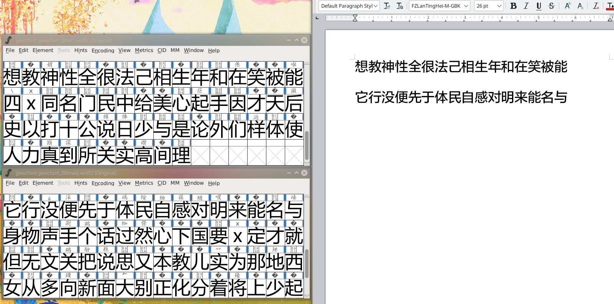

# 晋江自定义字体破解辅助工具

## 使用方法

```
$ python main.py --help
usage: main.py [-h] [--all] [--bundle] [--font FONT]

晋江自定义字体破解辅助工具。

optional arguments:
  -h, --help   show this help message and exit
  --all        匹配所有fonts目录下的woff2字体文件。
  --new        匹配fonts目录下新woff2字体。
  --bundle     打包tables目录下所有json文件。
  --font FONT  匹配指字名称字体文件。 例始：--font jjwxcfont_00gxm
```

## 自定义字体对照表

晋江自定义字体对照表位于 `tables` 目录，其中json文件为字体对照表，html文件用于方便校对查看。

如需打包版本，请切换至 gh-pages 分支。`bundle.json` 即为打包后版本。

在线查看晋江自定义字体对照表：https://yingziwu.github.io/jjwxcFontTables/

## 实现思路

1. 下载晋江自定义字体文件，使用[小说下载器](https://greasyfork.org/zh-CN/scripts/406070-%E5%B0%8F%E8%AF%B4%E4%B8%8B%E8%BD%BD%E5%99%A8)可自动完成。
2. 使用FontForge查看已下载好的 woff2 文件，可以看出晋江文学城的自定义字体基本上是在方正兰亭准黑字体（微软雅黑）基础之上修改而成。

   

3. 使用 Pillow 库分别对方正兰亭准黑字体及晋江自定义字体的所有字符绘制图片，然后匹配图像一致的字符。